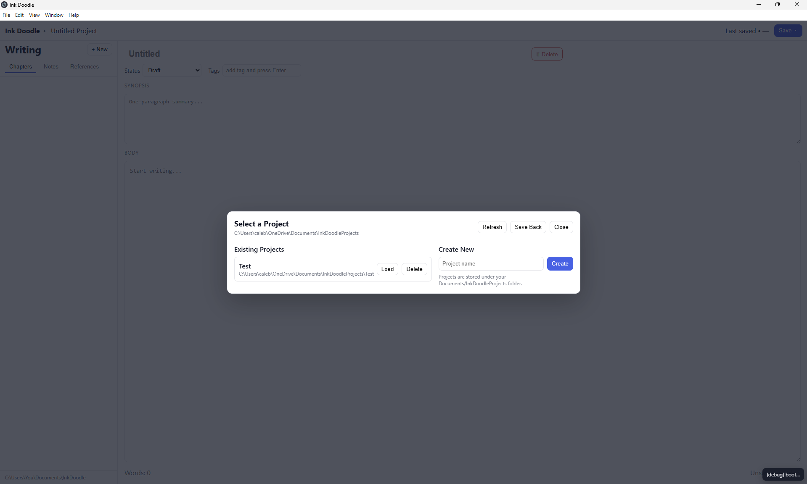
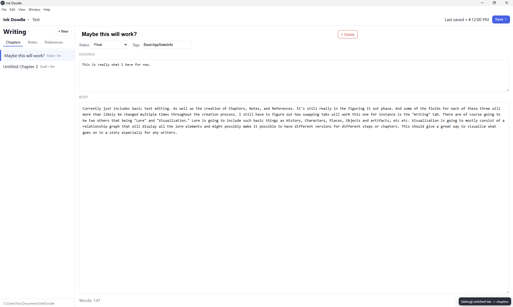
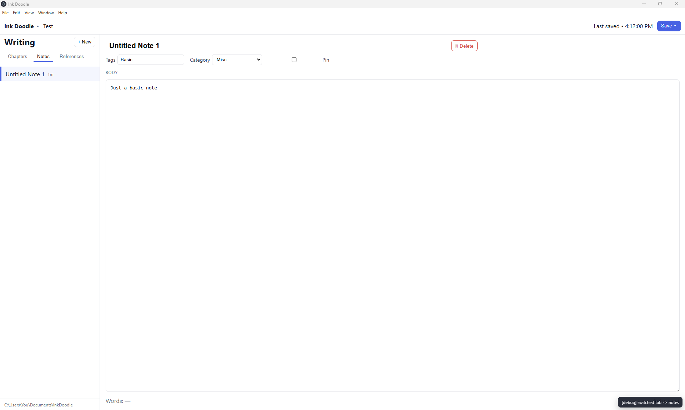
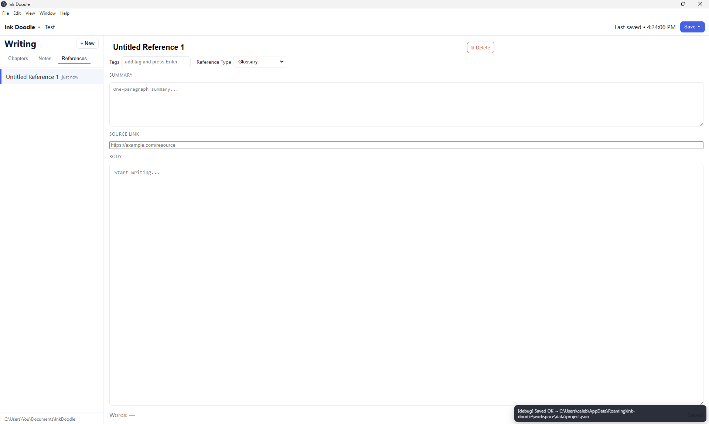

# Ink Doodle
A Creative Writing & Worldbuilding App for Fiction Authors

Ink Doodle is a lightweight desktop app built with Electron and JavaScript that helps writers plan and organize long-form fiction projects.  
It is designed for novelists, storytellers, and worldbuilders, focusing on structure and lore organization rather than raw text editing.

---

## Features (Current)
- Chapters, Notes, and References — Create, edit, and manage different entry types.
 - Lore / Worldbuilding editor — Create and edit unified Lore entries (freeform "lore kind") with paired custom fields (Field 1..4 name/content). Lore has a dedicated editor pane and is persisted to per-item JSON files under a project `lore/` folder.
- Autosave Engine — Automatically saves your work after a brief period of inactivity and on focus/tab/window changes.
- Drag & Drop Reordering — Rearrange entries within their lists.
- Entry Deletion — Delete entries from within the editor; menu action and keybind supported.
- Multiple Projects — Create, switch, and manage separate projects with an integrated project picker.
- Workspace and Save-Back System — Projects are stored in your Documents folder (`InkDoodleProjects`), with a local workspace for active editing.
  - Lore persistence parity: Lore entries are saved per-item (LOR-...json) in a `lore/` folder and indexed in `data/project.json`, matching the behavior of chapters/notes/refs.
- Keyboard Shortcuts  
  - Ctrl + S — Save workspace  
  - Ctrl + Shift + S — Save back to project directory  
  - Ctrl + P — Open project picker  
  - Ctrl + Backspace — Delete current entry

---

## Installation & Setup

### Prerequisites
- Node.js (LTS version recommended)
- Git
- VS Code (recommended for editing)

### Setup Steps
```bash
git clone https://github.com/CalebSessoms/ink-doodle.git
cd ink-doodle
npm install
npm start
```

---

## Project Structure
```
ink-doodle/
├── index.js                # Electron main process (menus, project I/O, IPC)
├── index.html              # UI layout
├── src/
│   └── renderer/
│       ├── app.js          # Frontend logic: state, autosave, DnD, editor wiring
│       └── app.css         # Styling
├── package.json
└── README.md
```

---

## Planned Development Milestones

### Week 3 — Core Writing Environment (Prototype)
**Goal:** Fully functional workspace for basic writing and project management.
- UI layout (sidebar, editor, menu integration)
- Create/edit Chapters, Notes, References
- Autosave and word count for chapters
- Drag-and-drop reordering of entries
- Entry deletion via button and keybind
- Multi-project system (picker, save-back integration)

### Week 5 — Lore and Data Management (Expansion)
**Goal:** Extend the system to support structured worldbuilding.
- Add lore categories (Characters, Locations, History, etc.)
- Implement tag-based filtering and search
- Introduce relationships between lore and chapters
- Persistent metadata and project summaries
- Improved autosave stability and undo/redo polish

### Recent progress (Nov 2025)
   - Loader/writer compatibility: the renderer load/save path now normalizes common legacy variants (for example `lore_type` → `lore_kind`, `entry1_name`/`entry1_content` → `entry1name`/`entry1content`, and `Field N Name/Content` variants) so existing projects load correctly and UI edits persist.
   - Content persistence: edits made in the Lore editor (the main body text) are now preserved and written back to the `content` field on disk rather than being overwritten by the original raw file value.
   - `src/main/db.format.ts` declares local lore field constants and now maps DB payloads into local lore shapes during DB→local translation, with added per-field debug logging to help trace missing values.
   - `src/main/db.query.ts` added a `getProjectLore` helper to fetch lore rows from the DB.
   - `src/main/db.load.ts` now creates the `lore/` directory during full-load and writes per-item lore JSON files into it.
 - Lore Editor: A unified Lore editor pane was added to the renderer. Lore is a single entry type where the user types a freeform "lore kind" rather than selecting discrete subtabs.
 - Custom fields: Lore supports four paired custom fields (name above content) rendered and styled to match other editor sections.
 - On-disk persistence & compatibility:
   - Lore is written to per-item JSON files inside a `lore/` folder and is indexed in `data/project.json` alongside `chapters`, `notes`, and `refs`.
   - The renderer now normalizes common legacy variants (for example `lore_type` → `lore_kind`, `entry1_name`/`entry1_content` → `entry1name`/`entry1content`, and `Field N Name/Content` variants) so existing projects load correctly and UI edits persist.
   - Edits made in the Lore editor (the main body text) are preserved and written back to the `content` field on disk rather than being overwritten by the original raw file value.
 - Renderer reliability: fixed several issues so Save Back reliably persists lore edits (including title changes and newly-created entries). The renderer now promotes legacy/raw fields into the view the UI uses and normalizes key variants so the editor shows values that were present on disk.
 - Main process / TypeScript updates: the backend helpers received lore support:
   - `src/main/db.format.ts` declares local lore field constants and maps DB payloads into local lore shapes during DB→local translation, with per-field debug logging added to help trace missing values.
   - `src/main/db.query.ts` added a `getProjectLore` helper to fetch lore rows from the DB.
   - `src/main/db.load.ts` now creates the `lore/` directory during full-load and writes per-item lore JSON files into it.
 - Debugging: per-field debug logging was added in the format/load code and in the renderer to help determine whether missing values originate from the DB, the DB→local translation, or the renderer load path.
 - Type-check: TypeScript checks (`npx tsc --noEmit`) were run after edits and passed with no errors.
 - Pending/runtime notes: uploader/runtime dry-runs (uploader invocation) encountered ESM/module-resolution issues in the current environment, so uploader runtime verification is pending; the loader/save fixes and debug logging are in place for when DB testing is available.

Notes: If you prefer to convert existing legacy-shaped lore files into the canonical shape on disk, I can add an optional migration/dry-run tool to rewrite files safely.

### Week 7 — Visualization and Advanced Tools (Final)
**Goal:** Visualization and export systems.
- Add relationship web / node graph
- Project overview dashboard (counts, recent edits, status summary)
- Export to Markdown / JSON / plain text
- Initial groundwork for publishing tools
- UI polish, testing, and optimization

---

## Future Features and Long-Term Goals
- Relationship graph refinements (draggable nodes, grouping, color-coding)
- Advanced search and filtering with multi-tag logic and saved filters
- Rich export flows (full project export, per-entry export, templated exports)
- Import tools for existing drafts and worldbuilding data
- Collaboration or multi-user mode (future exploration)
- User-defined templates for chapters and lore element types
- Simple analytics (word count history, progress charts)
- Optional “focus mode” writing environment

---

## Technical Notes
- Stack: Electron (main process + renderer), Node.js, HTML, CSS, plain JavaScript.
- Data Model: Single JSON file per project (`data/project.json`) with UI state persisted alongside entries.
- Workspace Model: Edits occur in an isolated workspace (under Electron `userData`); “Save Back” syncs to the project directory in Documents.
- Autosave: Idle-based with a failsafe timer and save-on-visibility-change.

---

## Screenshots

### Example View





## Author
Caleb Sessoms  
Developed as part of the CS399 Independent Project (Computer Science A.S. Program)  
GitHub: https://github.com/CalebSessoms/ink-doodle

---

## Database-Backed Mode (Neon PostgreSQL Integration)

Ink Doodle now supports saving and loading data through a managed **PostgreSQL** database (hosted on **Neon**).  
This replaces some local JSON storage with persistent cloud-based storage for project metadata and user preferences.

### Current Database Features
- ✅ `db:ping` connection test (visible in DevTools console)
- ✅ `prefs:get` and `prefs:set` — settings now persist through the database
- ⚙️ Workspace projects and entries still use local JSON until DB synchronization is complete
- 🧩 Neon connection handled via `DATABASE_URL` in `.env`

### Quick Test
1. Launch the app (`npm start`).
2. Open DevTools → Console → run  
   ```js
   require('electron').ipcRenderer.invoke('db:ping')
You should see a response with the server time and Postgres version.
3. Open Settings → Theme/Background and toggle the mode.
The change should log a line similar to:

csharp
Copy code
[debug] prefs:set -> ui_prefs saved
Troubleshooting
If database operations fail:

Check that your .env file contains a valid DATABASE_URL.

Confirm Neon is online.

Review your local debug log at

lua
Copy code
%APPDATA%\ink-doodle\workspace\debug.log
(or ~/Library/Application Support/ink-doodle/workspace/debug.log on macOS).

Look for lines starting with [debug] db: or [debug] prefs: for detailed context.

Progress Summary (as of October 2025)
Local autosave and workspace project system: stable

Theme/background preferences: persisted to DB

Postgres integration: ping + prefs live

Next phase: project entries and autosave synchronization via database